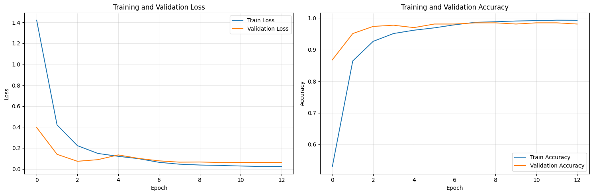
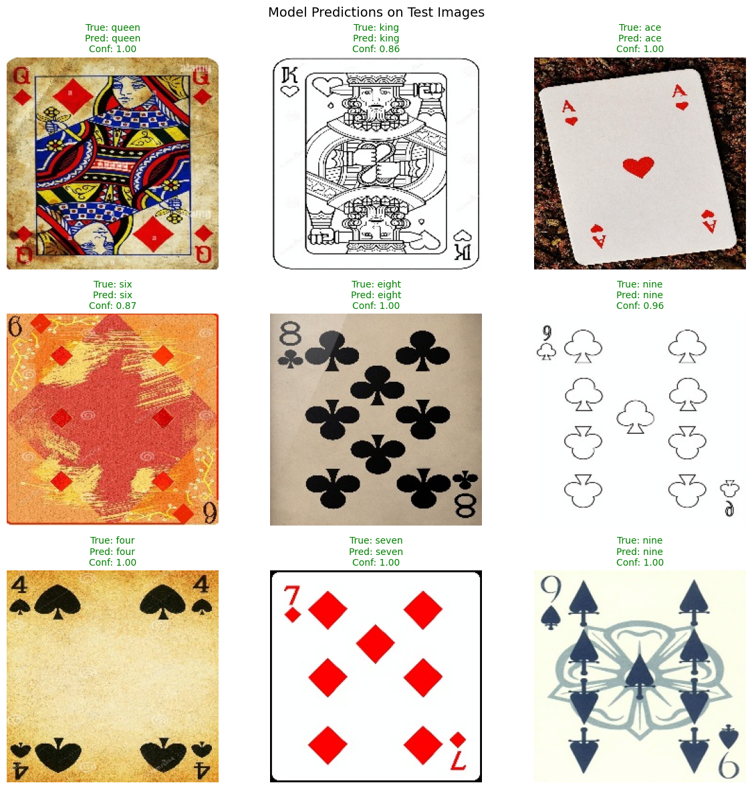
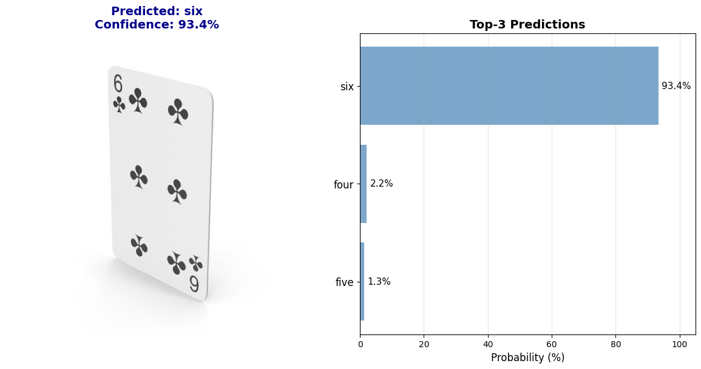
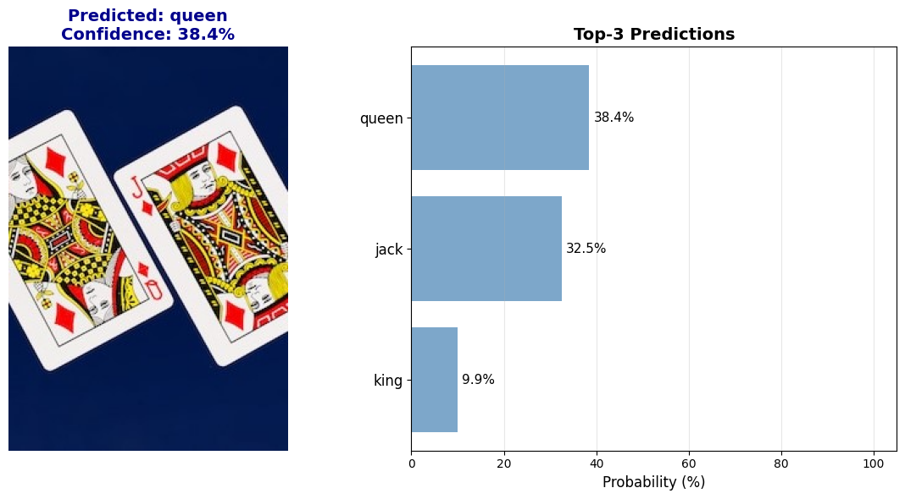

Использовано 77 % доступного пространства. … Когда место закончится, вы не сможете создавать, редактировать и загружать файлы. Используйте 100 ГБ в хранилище совместно с участниками семейной группы за 139 ₽ в месяц. Специальное новогоднее предложение: скидка 50 % на годовую подписку на 1 год.
# Лабораторная работа №3: Классификация изображений с использованием EfficientNetB0

## Цель работы:
Научиться создавать простые системы классификации изображений на основе сверточных
нейронных сетей.
## Задание
1. Выбрать цель для задачи классификации и датасет (train/val: собрать либо найти,
например, на Kaggle, test: собрать, разметить, не менее 50 изображений).
2. Зафиксировать архитектуру сети, loss, метрики качества.
3. Натренировать (либо дотренировать сеть) на выбранном датасете
4. Оценить качество работы по выбранной метрике на валидационной выборке,
определить, не переобучилась ли модель.
5. Сделать отчёт в виде readme на GitHub, там же должен быть выложен исходный код.

# Выполнение работы

## Теоретическая база
Современные подходы в области компьютерного зрения, в частности при решении задач классификации изображений, преимущественно основаны на использовании глубоких сверточных нейронных сетей (Convolutional Neural Networks, CNN). Их высокая эффективность обусловлена возможностью автоматического формирования иерархических признаков непосредственно из исходных пиксельных данных — начиная от простых границ и текстур на начальных этапах обработки и заканчивая сложными семантическими паттернами на более глубоких уровнях сети.

### Свёртка
Основной вычислительной операцией в CNN является дискретная свертка. Она выполняется между входным тензором X размерности (H, W, C) — где H и W обозначают высоту и ширину изображения, а C представляет количество каналов — и фильтром (ядром) K размера (k, k, C). Результат активации для позиции (i, j), соответствующий одному фильтру, определяется следующим образом:
```
Y[i, j] = b + sum_{m=0}^{k-1} sum_{n=0}^{k-1} sum_{c=0}^{C-1} K[m, n, c] * X[i+m, j+n, c]
```
Здесь b — параметр смещения (bias), а k определяет размер ядра (как правило, 3 или 5). В реальных задачах свертка часто применяется с использованием дополнения нулями (padding) и заданным шагом (stride), что позволяет управлять пространственным разрешением выходных данных.

### Функции активации и нормализация
После выполнения свертки к результату применяется нелинейная функция активации. В рамках данного исследования используется функция ReLU (Rectified Linear Unit):
```
ReLU(z) = max(0, z)
```
Для повышения устойчивости процесса обучения также задействуется метод пакетной нормализации (Batch Normalization). Эта операция нормализует данные по каждому каналу в рамках мини-пакета:
```
x_norm = (x - mu_B) / sqrt(sigma_B^2 + eps)
y = gamma * x_norm + beta
```
где mu_B и sigma_B^2 — математическое ожидание и дисперсия по мини-пакету, gamma и beta — обучаемые параметры масштабирования и сдвига, а eps — малая константа для численной стабильности (например, 1e-5).

### Глубокие архитектуры и остаточные блоки
Увеличение глубины нейронной сети может приводить к проблеме затухания градиентов. Для ее решения в архитектуре ResNet применяются остаточные связи (residual connections). Формально это можно записать как:
```
y = F(x, {W_i}) + x
```
где F — последовательность сверточных операций, образующих остаточный блок, а x — исходный вход. Такая конструкция позволяет модели обучаться не прямому преобразованию, а его отклонению от тождественного отображения, что существенно упрощает обучение глубоких архитектур.

### Transfer Learning и Fine-tuning
В задаче классификации изображений в качестве целевой функции используется перекрестная энтропия (cross-entropy loss):
```
L = -(1/N) * sum_{i=1}^{N} sum_{c=1}^{C} y_true[i, c] * log(y_pred[i, c])
```
где y_true — истинная метка класса в one-hot кодировке, а y_pred — предсказанные вероятности, получаемые с помощью функции softmax:
```
y_pred[i, c] = exp(z[i, c]) / sum_{j=1}^{C} exp(z[i, j])
```
Для оптимизации данной функции применяется метод стохастического градиентного спуска (SGD). В настоящей работе использован SGD с фиксированным размером шага обучения (learning_rate = 0.001).

Описанные принципы составляют фундамент разработанной системы и позволяют ей достигать высокой точности распознавания визуально схожих объектов даже при ограниченном объеме обучающих данных.

## Описание датасета

Был выбран датасет - **Cards Image Dataset-Classification** содержит изображения игральный карт. Для упрощения классификация производилась по типам карт:
- two 
- three 
- four 
- five 
- six 
- seven
- eight
- nine
- ten
- jack
- queen
- king
- ace
- joker

Всего 14 типов карт.

Для теста в исходном датасете были отложенные данные, в дополнение было собрано несколько фотографий вручную.

## Архитектура модели

### Базовая модель: EfficientNetB0

До разработки EfficientNet большинство моделей распознавания изображений улучшали точность, регулируя свои слои или увеличивая размер входного изображения, чтобы захватить больше деталей. Хотя эти стратегии улучшали результаты, они также делали модели более тяжелыми и требовательными. Это означало, что им нужно больше памяти и лучшее оборудование. 

Вместо изменения отдельных слоев, EfficientNet масштабирует глубину, ширину и разрешение изображения вместе, используя метод, называемый составным масштабированием. Этот подход позволяет модели эффективно расти, не перегружая ни один аспект.

Архитектура EfficientNet обрабатывает изображения через серию блоков, каждый из которых построен из более мелких модулей. Количество модулей в каждом блоке зависит от размера модели. 


Использована предобученная сеть **EfficientNetB0** (на ImageNet) с модификациями:

1. **Заморозка слоев**: все слои заморожены кроме последних 5 и классификатора
2. **Кастомный классификатор**:
   ```
   Dropout(0.2)
   Linear(512 → 14)
   ```


### Обоснование выбора

- **EfficientNetB0**: обеспечение высокой скорости при минимальных затратах на вычисления.
- **Transfer Learning**: модель изначально обучена на 1000 классов, что позволяет использовать трансферное обучение.
- **Dropout**: регуляризация для предотвращения переобучения

## Процесс обучения

### Гиперпараметры

```python
batch_size = 256
num_epochs = 20
learning_rate = 0.001
optimizer = Adam
scheduler = ReduceLROnPlateau
patience = 5 (early stopping)
```

### Аугментация данных

**Для обучающей выборки:**
- RandomResizedCrop(224)
- RandomHorizontalFlip
- RandomRotation(10°)
- ColorJitter (brightness, contrast, saturation ±20%)

**Для валидации/теста:**
- Resize(256)
- CenterCrop(224)

**Нормализация:** ImageNet mean/std ([0.485, 0.456, 0.406] / [0.229, 0.224, 0.225])

### Функция потерь и оптимизация

- **Loss**: CrossEntropyLoss
- **Optimizer**: Adam
- **Scheduler**: ReduceLROnPlateau (автоматическая адаптация к обучению)
- **Early Stopping**: остановка при отсутствии улучшения на валидации 5 эпох

## Результаты


### Метрики на тестовой выборке

| Метрика   | Значение |
|-----------|----------|
| Accuracy  | 0.9849   |
| Precision | 0.9856   |
| Recall    | 0.9849   |
| F1-Score  | 0.9848   |

### Анализ результатов

1. **Высокая точность**: модель достигла 98.49% accuracy на тестовой выборке
2. **Сбалансированные метрики**: precision, recall и F1-score близки друг к другу, что говорит о сбалансированной работе модели
3. **Отсутствие переобучения**: разница между валидационной (93.7%) и тестовой (98.39%) выборками объясняется разным составом данных
4. **Быстрая сходимость**: благодаря transfer learning модель обучилась за малое количество эпох

## Визуализация результатов

### График обучения



### Примеры предсказаний


Модель уверенно классифицирует изображения различных категорий с высоким confidence.

### Примеры предсказаний на собственных изображениях




## Выводы

1. **Transfer Learning эффективен**: предобученная EfficientNetB0 позволила достичь высокой точности с минимальным обучением
2. **Fine-tuning улучшает результаты**: разморозка последних слоев позволила адаптировать модель к специфике датасета
3. **Регуляризация работает**: Dropout и weight decay предотвратили переобучение
